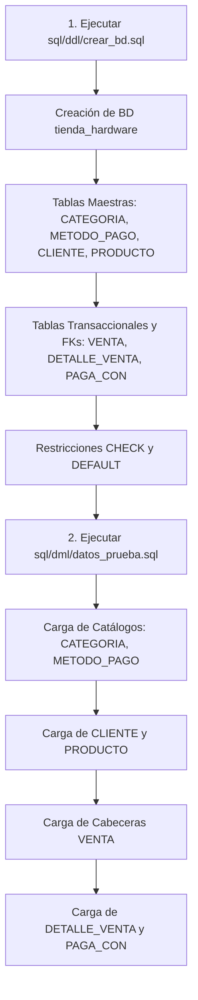

# Guía de Implementación Física (DDL y DML)

## Proyecto Integrador — Bases de Datos I (Año 2026)
**Equipo de Proyecto:** Equipo 51  
**Dominio:** Sistema de Gestión Comercial e Inventario de Hardware  
**Autor:** Nuñez Axel Gabriel  
**Etapa:** Etapa III — Implementación Física  

---

## 1. Introducción y Enfoque de Implementación

La Etapa III materializa el modelo lógico relacional (3FN) diseñado en la etapa anterior en un esquema de base de datos físico, ejecutable y validado. Para este proyecto se seleccionó el motor relacional **Microsoft SQL Server** (T-SQL), utilizando herramientas estándar como **SQL Server Management Studio (SSMS)**.

El objetivo central es garantizar que la base de datos soporte el ciclo de comercialización de componentes de hardware garantizando la integridad de entidad, la integridad referencial y las reglas de negocio críticas definidas en la Etapa I.

---

## 2. Estructura de Scripts y Organización del Repositorio

En cumplimiento estricto con el árbol de directorios oficial de la cátedra para el repositorio Git, los artefactos de código SQL se organizan en la carpeta raíz `sql/` de la siguiente manera:

```text
sql/
├── ddl/
│   └── crear_bd.sql         <-- Definición de base de datos, tablas y restricciones
└── dml/
    └── datos_prueba.sql     <-- Poblado inicial con datos coherentes para pruebas
```

### 2.1. Script DDL: `sql/ddl/crear_bd.sql`
Este archivo concentra toda la creación estructural y se encuentra dividido en tres bloques funcionales:
* **Bloque 1 (Tablas Base y Maestras):** Inicialización de la base de datos `tienda_hardware` y creación de las tablas independientes del catálogo (`CATEGORIA`, `METODO_PAGO`, `CLIENTE`, `PRODUCTO`) con sus tipos de datos, `PRIMARY KEY` y restricciones `UNIQUE`.
* **Bloque 2 (Tablas Transaccionales y FKs):** Creación de las tablas dependientes (`VENTA`, `DETALLE_VENTA`, `PAGA_CON`) e implementación de las claves foráneas con reglas de actualización y eliminación (`ON UPDATE CASCADE`, `ON DELETE CASCADE` y `ON DELETE NO ACTION / RESTRICT`).
* **Bloque 3 (Restricciones CHECK y DEFAULT):** Incorporación de reglas de validación de dominio (precios positivos, stock no negativo, consistencia de stock reservado y formato de correo electrónico) y valores por defecto automáticos.

### 2.2. Script DML: `sql/dml/datos_prueba.sql`
Este archivo contiene el lote de prueba inicial con al menos 8 a 10 registros coherentes por tabla:
* **Parte 1 (Catálogos y Maestros):** Poblado de 10 categorías de hardware, 8 métodos de pago, 10 clientes particulares y 10 productos de alta gama con existencias iniciales.
* **Parte 2 (Transacciones Comerciales):** Inserción de 10 ventas completas, 17 renglones de detalle de venta y 14 registros de cobros multipago, con correspondencia aritmética exacta.

---

## 3. Orden Secuencial de Ejecución

Para garantizar una instalación limpia sin conflictos de dependencias referenciales, la ejecución de los scripts debe respetar el siguiente orden estricto:



### Justificación Técnica del Orden:
1. **Prioridad del DDL:** No es posible insertar datos si las estructuras de almacenamiento y sus tipos de datos no existen previamente.
2. **Jerarquía en DDL:** Las tablas independientes (fuertes) deben crearse antes que las tablas dependientes para que las sentencias `FOREIGN KEY` encuentren la tabla y columna de destino válida.
3. **Jerarquía en DML:** 
   * Primero se pueblan `CATEGORIA` y `METODO_PAGO`, ya que no dependen de nadie.
   * Luego se carga `PRODUCTO` (depende de `CATEGORIA`) y `CLIENTE`.
   * A continuación se inserta `VENTA` (depende de `CLIENTE`).
   * Finalmente se insertan `DETALLE_VENTA` (depende de `VENTA` y `PRODUCTO`) y `PAGA_CON` (depende de `VENTA` y `METODO_PAGO`). De lo contrario, el motor abortaría la transacción por violación de integridad referencial.

---

## 4. Estructura Detallada de las Tablas Físicas

A continuación se detalla la correspondencia física de las 7 tablas normalizadas en 3FN:

| Tabla | Rol / Naturaleza | Clave Primaria (PK) | Claves Foráneas (FK) | Restricciones Adicionales |
| :--- | :--- | :--- | :--- | :--- |
| **`CATEGORIA`** | Catálogo Maestro | `codigo_categoria` (INT) | Ninguna | `UQ_CATEGORIA_nombre` |
| **`METODO_PAGO`** | Catálogo Maestro | `codigo_metodo` (INT) | Ninguna | `UQ_METODO_PAGO_nombre` |
| **`CLIENTE`** | Catálogo Maestro | `dni_cuit` (VARCHAR(20)) | Ninguna | `UQ_CLIENTE_email`, `CHK_email` |
| **`PRODUCTO`** | Catálogo Maestro | `sku` (VARCHAR(50)) | `codigo_categoria` $\rightarrow$ `CATEGORIA` | `CHK_precio`, `CHK_stock`, `DF_reservado=0` |
| **`VENTA`** | Cabecera Transaccional | `codigo_venta` (INT) | `dni_cuit` $\rightarrow$ `CLIENTE` | `CHK_monto_total`, `DF_fecha=CURRENT_TIMESTAMP` |
| **`DETALLE_VENTA`** | Renglón / Entidad Débil | `(codigo_venta, sku)` | `codigo_venta` $\rightarrow$ `VENTA`<br>`sku` $\rightarrow$ `PRODUCTO` | `CHK_cantidad > 0`, `CHK_precio_uni >= 0` |
| **`PAGA_CON`** | Tabla Intermedia N:M | `(codigo_venta, codigo_metodo)` | `codigo_venta` $\rightarrow$ `VENTA`<br>`codigo_metodo` $\rightarrow$ `METODO_PAGO` | `CHK_monto > 0` |

### Notas de Diseño Físico:
* **Precisión Monetaria:** Todos los importes monetarios (`precio_lista`, `precio_unitario`, `monto_total`, `monto`) utilizan el tipo `DECIMAL(12, 2)`, evitando las imprecisiones de redondeo de tipos flotantes.
* **Atributo Derivado:** Se ratifica que `stock_disponible` no posee columna física en la tabla `PRODUCTO`; se obtiene dinámicamente mediante la fórmula: `(stock_actual - stock_reservado)`.
* **Inmutabilidad:** En `DETALLE_VENTA`, la columna `precio_unitario` almacena el valor pactado al momento de la venta, blindando los comprobantes históricos frente a futuros cambios de precios en `PRODUCTO.precio_lista`.
